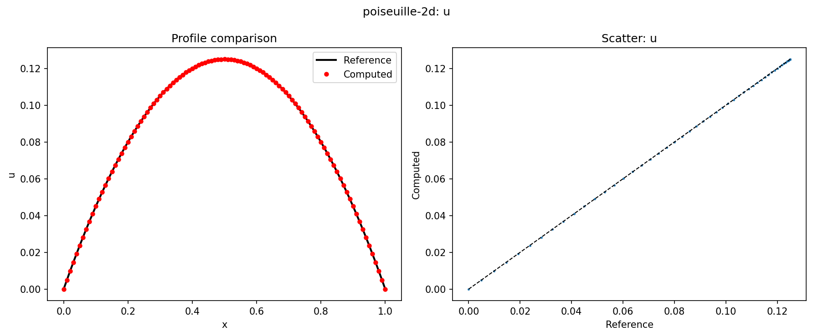
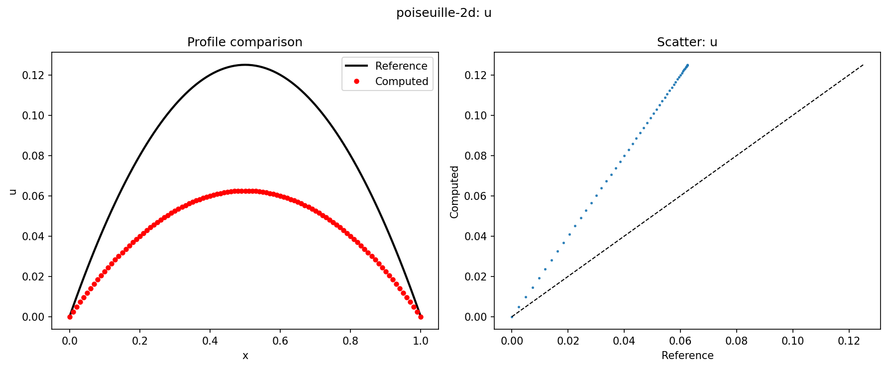

# Quick Start

## 1. Install

```bash
# From PyPI (recommended — includes all test cases, no clone needed)
pip install cfdvv

# Or from source (for development)
git clone https://github.com/vvp-cfd/cfd-vv-suite.git
cd cfd-vv-suite
pip install -e tools/

# Docker images
docker pull vvpcfd/cfdvv                          # Docker Hub
docker pull ghcr.io/vvp-cfd/cfd-vv-suite           # GitHub Container Registry
```

See [jupyter-guide.md](jupyter-guide.md) for the Python API reference and [example/cfdvv-demo.ipynb](https://github.com/vvp-cfd/cfd-vv-suite/blob/main/example/cfdvv-demo.ipynb) for a runnable Jupyter notebook walkthrough.

## 2. Browse Cases

```bash
cfdvv list                             # all cases
cfdvv list -c verification             # verification only
cfdvv list -c validation               # validation only
cfdvv list -c verification -t 3d       # verification, 3D
```

## 3. Inspect a Case

```bash
cfdvv info poiseuille-2d       # short ID — resolves automatically
cfdvv info tools/cfdvv/cases/verification/incompressible/poiseuille-2d  # full path also works
```

All commands accept both case IDs and full paths.

Shows: physics, boundary conditions, **mesh requirements** (including recommended resolution and grids for convergence study), expected quantities, and tolerances.

## 4. Run Your Solver

### Option A: Any solver -> CSV

1. Read the case `README.md` and `case.yaml` --- geometry, BCs, and **mesh requirements** (`mesh:`)
2. Generate a mesh per the recommended resolution
3. Run the simulation
4. Export results as CSV:

```csv
x, y, u, v, p
0.0, 0.0, 0.0, 0.0, 1.5
```

### Option B: OpenFOAM (ready-to-run cases)

Five cases have complete OpenFOAM directories with `blockMeshDict` and `Allrun`:

```bash
cd tools/cfdvv/cases/verification/incompressible/poiseuille-2d/openfoam && ./Allrun
cd tools/cfdvv/cases/verification/incompressible/couette-2d/openfoam && ./Allrun
cd tools/cfdvv/cases/verification/incompressible/lid-driven-cavity/openfoam && ./Allrun
cd tools/cfdvv/cases/verification/incompressible/taylor-green-vortex-2d/openfoam && ./Allrun
cd tools/cfdvv/cases/verification/compressible/sod-shock-tube/openfoam    # blockMesh + rhoCentralFoam
```

#### Using our Docker image

Pull the pre-built OpenFOAM + cfdvv image (cases are baked into the image):

```bash
docker pull vvpcfd/cfdvv-openfoam                         # Docker Hub
docker pull ghcr.io/vvp-cfd/cfd-vv-suite-openfoam          # GitHub Container Registry

docker run --rm vvpcfd/cfdvv-openfoam
```

Or build from the [Dockerfile](https://github.com/vvp-cfd/cfd-vv-suite/blob/main/ci/Dockerfile.openfoam):

```bash
docker build -t cfdvv-openfoam -f ci/Dockerfile.openfoam .
docker run --rm cfdvv-openfoam
```

### Option C: Generate analytical solution on your mesh

For cases with analytical solutions, use `scripts/generate_solution.py`:

```bash
python tools/cfdvv/cases/verification/incompressible/poiseuille-2d/scripts/generate_solution.py <nx> <ny> output.csv
python tools/cfdvv/cases/verification/incompressible/taylor-green-vortex-2d/scripts/generate_solution.py 64 output.csv
python tools/cfdvv/cases/verification/incompressible/beltrami-flow-3d/scripts/generate_solution.py 21 beltrami.csv
```

## 5. Compare Results

### Verification (analytical)

```bash
cfdvv compare poiseuille-2d \
    --result my_results.csv --norm L2 --plot
```

The `--plot` flag generates a 3-panel comparison figure for each field:

- **1D cases**: reference profile (black line) vs computed values (red dots), plus a scatter plot of matched values
- **2D cases**: filled scatter plots of reference and computed fields side-by-side, plus a correlation scatter

Example output for a well-matching case (poiseuille-2d, u-velocity):



And a poor match (15% noise added to trigger a FAILED verdict):



### Auto-generate reference on your grid

If your grid differs from the reference, use `--auto-generate`:

```bash
cfdvv compare poiseuille-2d \
    --result my_results.csv --auto-generate --plot
```

For analytical cases, this runs `scripts/generate_solution.py` on-the-fly with your grid dimensions.
For MMS and experimental cases with CSV data, it falls back to nearest-neighbor matching.

### Validation (experimental/DNS)

```bash
cfdvv compare cylinder-re20 \
    --result my_results.csv --norm Relative_L2

cfdvv compare channel-flow-retau180 \
    --result my_uplus_profile.csv --norm L2
```

### Expected errors when grid mismatch occurs

When comparing without `--auto-generate` and your grid doesn't match the reference:

```
Case: Plane Poiseuille Flow (poiseuille-2d)
Result: my_coarse_results.csv

Field           Norm         Value          Min(ref)     Max(ref)
--------------------------------------------------------------------------------
u               L2           3.270e-02     0.0000       0.1250
v               L2           1.450e-03     0.0000       0.0000

WARNING: Reference has 101 points but result has 11 points.
         Consider using --auto-generate or matching the reference grid.
         Expected L2 < 1e-6 for matching grid.
PASS/FAIL: the tolerance check compares matched points only.
```

## 6. Generate a Report

```bash
cfdvv report poiseuille-2d \
    --result my_results.csv --output report.html
```

The report is a standalone HTML file containing:

- Case metadata (physics, geometry, reference source with DOI links)
- Comparison table with all error norms (L1, L2, Linf, Relative L2)
- Embedded comparison plots for each field
- PASSED / FAILED badge with color coding
- Case parameters with descriptions
- No external dependencies --- open in any browser

Example outputs (open in your browser):

- [report-good.html](examples/report-good.html) — PASSED (good_poiseuille.csv, all errors zero)
- [report-bad.html](examples/report-bad.html) — FAILED (bad_poiseuille.csv, noisy data)

For validation cases:

```bash
cfdvv report channel-flow-retau180 \
    --result my_uplus.csv --output channel_report.html
```

## 7. Grid Convergence Study (GCI)

**GCI** (Grid Convergence Index) estimates how far your solution is from the asymptotic (infinite-mesh) value, based on Roache's uniform reporting methodology (ASME V&V 20).

### Requirements

- At least 3 mesh levels with constant refinement ratio (typically r = 2)
- The same quantity evaluated on each mesh (e.g., L2 norm of a field)
- Meshes must be in the asymptotic convergence range (p should be approximately constant)

Typical workflow:

```bash
# Run your solver on 3 meshes, export results
cfdvv compare tools/cfdvv/cases/... -r coarse_results.csv   # Note the L2 value
cfdvv compare tools/cfdvv/cases/... -r medium_results.csv
cfdvv compare tools/cfdvv/cases/... -r fine_results.csv

# Then compute GCI
cfdvv gci tools/cfdvv/cases/... -r coarse_results.csv -r medium_results.csv -r fine_results.csv
```

Real example using three grids (6, 11, and 21 points) against the Poiseuille analytical solution:

```bash
cfdvv gci poiseuille-2d \
    --results gci-coarse.csv --results gci-medium.csv --results gci-fine.csv \
    --mesh-sizes 0.05,0.025,0.0125
```

Output:

```
GCI Analysis for: poiseuille-2d
Mesh sizes: [0.05, 0.025, 0.0125]
Refinement ratios: [2.0, 2.0]

  Quantity 0 (u-field L2 error):
    f1 (coarse) = 0.00363335
    f2 (med)    = 0.00090830
    f3 (fine)   = 0.00022690
    Order p     = 2.00
    Extrapolated = 0.00454193
    GCI         = 0.312583
```

Key observations:
- **p ≈ 2.0**: confirms 2nd-order convergence (expected for linear interpolation / 2nd-order schemes)
- **GCI ≈ 0.31**: the fine-mesh error is about 31% of the coarse-grid error estimate — reasonable asymptotic ratio
- **Error ratio**: each mesh halving reduces error by ~4× (h² convergence)

The [example CSVs](https://github.com/vvp-cfd/cfd-vv-suite/tree/main/tools/tests/integration_data) used above are available in `tools/tests/integration_data/`.

See [comparison-methodology.md](comparison-methodology.md) for full mathematical details.

## Case Directory Structure

```
poiseuille-2d/
+-- case.yaml               # Metadata (includes mesh: requirements)
+-- README.md               # Physics, geometry, boundary conditions
+-- reference/              # Reference data (CSV)
|   +-- analytical/
+-- openfoam/               # Ready-to-run OpenFOAM case (selected cases)
|   +-- Allrun
|   +-- system/
|   +-- 0/
+-- scripts/                # Solution generation scripts (selected cases)
|   +-- generate_solution.py
+-- geometry/               # Geometry (STEP/STL)
+-- meshes/                 # Pre-built meshes
```

## Built-in OpenFOAM Cases

| Case | Solver | Mesh | Script |
|------|--------|------|--------|
| `poiseuille-2d` | icoFoam | blockMesh (10x20) | Allrun |
| `couette-2d` | icoFoam | blockMesh (8x16) | Allrun |
| `lid-driven-cavity` | icoFoam | blockMesh (32x32) | Allrun |
| `taylor-green-vortex-2d` | icoFoam | blockMesh (64x64) | Allrun |
| `sod-shock-tube` | rhoCentralFoam | blockMesh (200x1) | blockMesh + run |

For all other cases --- see `mesh:` in `case.yaml` for grid requirements and `scripts/generate_solution.py` for analytical generation.
